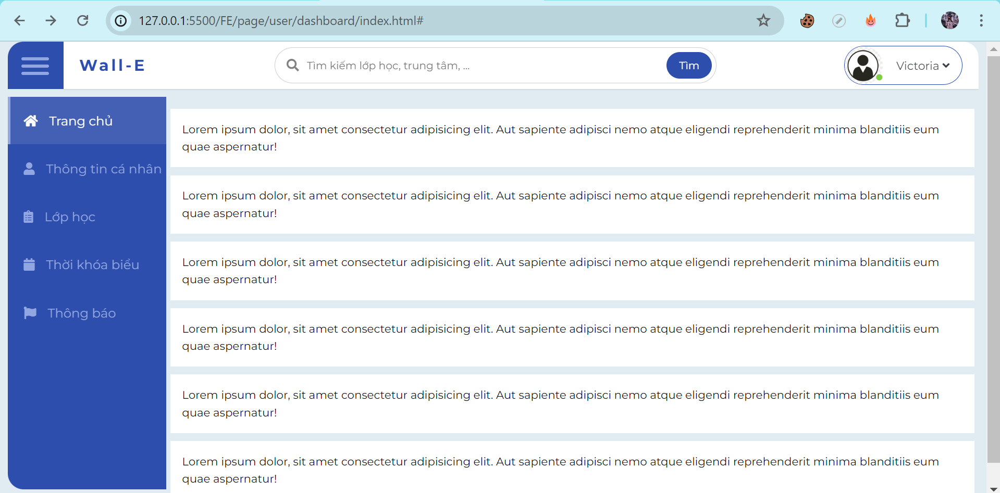

# SWP391
..
Một số page đã có giao diện
* Auth:
* Auth:
- Đăng ký
 
- Đăng nhập
 
- Quên mật khẩu
 
- Gửi OTP Code
 
- Phân role
 
- Đổi mật khẩu
 
 *User
- Trang chủ người dùng (có dropdown ava)

- Xem/đổi thông tin cá nhân
 
* Guest:

* Admin:
- Trang chủ của admin:
  
- Xem chi tiết thông báo
  
- Quản lý người dùng (tài khoản)
  
- Trang duyệt bài đăng:
  
- Trang tạo bài đăng (chưa css xong)
  
- Chi tiết duyệt bài đăng
  

